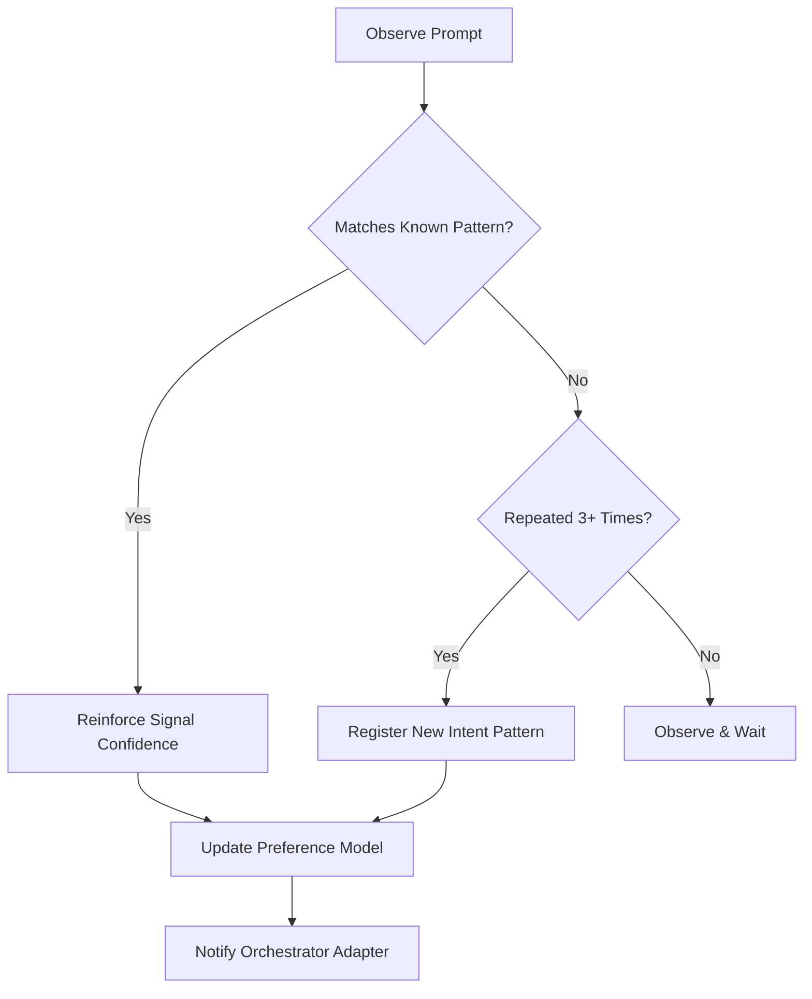

# User Intent Pattern Analyzer

## Purpose

Learns how the user likes to work. By identifying patterns in feedback and corrections, this skill allows the system to preemptively align with the user's preferred style (e.g., "Spec-heavy" vs "Speed-first").

## When to use this skill
- Continuously in the background of every conversation
- When a user repeatedly corrects a specific type of AI behavior
- When a user explicitly states a new preference or constraint

## Analysis Steps

1. **Track Repeated Constraints**: Note if the user always mentions things like "no guess" or "strict types".
2. **Identify Pain Points**: Where does the user intervene most? (e.g., "Always edits the design doc").
3. **Detect Dissatisfaction**: Analyze negative feedback to identify the underlying skill failure.
4. **Emit Probabilistic Signals**: "User prefers AI autonomy: high (confidence 0.8)".

## Decision Tree

## Review Checklist

1. **Evidence**: Is there a concrete list of prompts justifying this pattern?
2. **Privacy**: Ensure NO personal data or PII is stored in the intent patterns.
3. **Autonomy**: Balance intent-following with the project's hard safety rules.
4. **Reversibility**: Can the user easily override an inferred preference?

## How to provide feedback
- **Be specific**: "The analyzer inferred I prefer 'minimal detail', but I only wanted that for *this specific* task."
- **Explain why**: "Incorrectly assuming a preference leads to future planning gaps."
- **Suggest alternatives**: "Recommend adding 'Task-Specific' vs 'Permanent' flags to intent signals."

Signals are probabilistic, not absolute.
