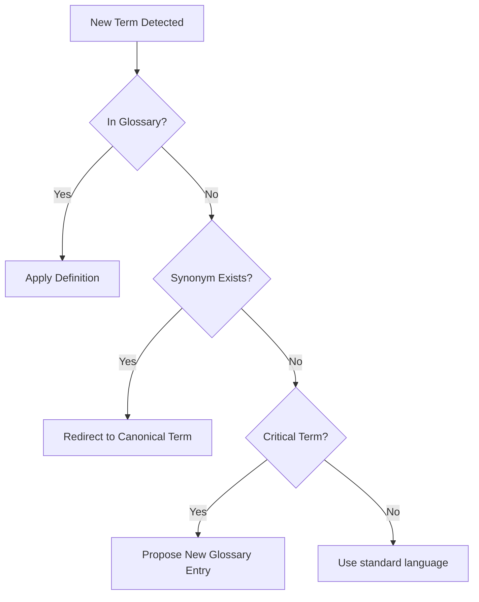

# Workspace Domain Glossary

## Purpose

Maintains a single source of truth for business terminology. This ensures that designers, developers, and stakeholders mean the same thing when using specific terms.

## When to use this skill
- When writing or reviewing specifications
- During migration of complex business logic
- When detecting conflicting terminology in code or docs

## Glossary Steps

1. **Extract Domain Terms**: Identify nouns and concepts unique to this business domain.
2. **Define Canonical Meanings**: Create one-sentence definitions that are universally accepted.
3. **Detect Conflicting Usage**: Flag cases where different terms are used for the same concept (e.g., "Customer" vs "User" vs "Client").
4. **Enforce Consistency**: Update code, specs, and docs to use the canonical term.

## Decision Tree

## Review Checklist

1. **Precision**: Is the definition narrow enough to avoid confusion?
2. **Universality**: Is this term used the same way across all components?
3. **Justification**: Is there a strong reason for this naming choice?
4. **Simplicity**: Avoid jargon where plain language works.

## How to provide feedback
- **Be specific**: "Term 'AccountExpiry' is used here, but glossary defines 'SubscriptionEnd'."
- **Explain why**: "Using multiple terms for the same concept increases cognitive load for maintainers."
- **Suggest alternatives**: "Recommend replacing 'AccountExpiry' with 'SubscriptionEnd' to match the domain glossary."

Never invent new terms without justification.
