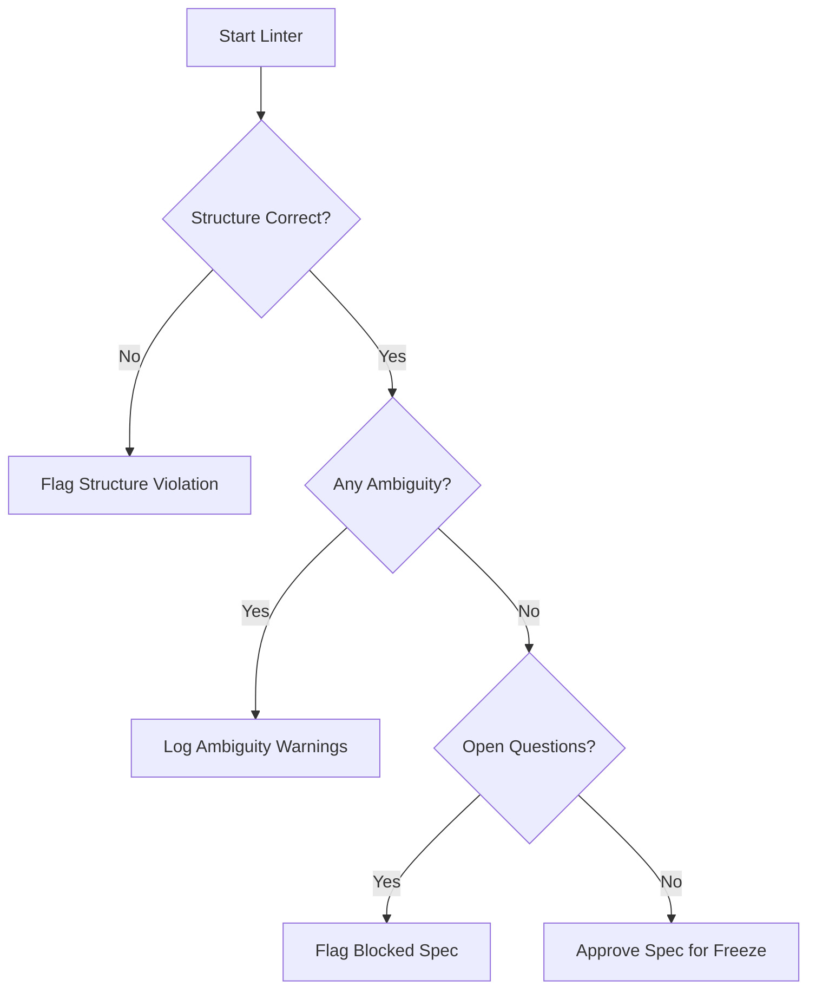

# Workspace Spec Linter

## Purpose

Ensures that specifications are high-quality, unambiguous, and ready for implementation. This skill prevents downstream errors caused by vague or contradictory requirements.

## When to use this skill
- Before implementation starts
- During migration design phases
- When reviewing specification updates

## Linting Steps

1. **Detect Ambiguity**: Look for words like "maybe", "approximately", "should probably". Replace with absolute constraints.
2. **Enforce Project Structure**: Ensure the spec follows the [spec-template](../_templates/spec-template.md).
3. **Flag Missing Decisions**: Identify any [ ] Open Questions that haven't been resolved.
4. **Ensure Testability**: Verify that every behavior has a clear "Expected Outcome" that can be asserted in a test.

## Decision Tree

## Review Checklist

1. **Completeness**: Are all critical paths covered?
2. **Clarity**: Could a developer implement this without asking a question?
3. **Traceability**: Does every requirement have a unique ID?
4. **Consistency**: Does it contradict any existing specs?

## How to provide feedback
- **Be specific**: Instead of "Spec is vague", say "The rate limit in AUTH-001 is not specified."
- **Explain why**: "Without a specific limit, the self-test-generator cannot assert correct behavior."
- **Suggest alternatives**: "Suggest adding '5 requests per 60 seconds' to clause AUTH-001."

If spec is unclear, implementation must stop.
