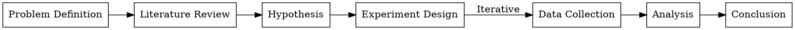

# 学术绘图指南 (Figure Creation Process)

学术论文中的图表不仅仅是装饰，而是论证的核心部分。

## 绘图原则

1.  **信息密度**：每一平方厘米的图表都应传递最大的信息量。
2.  **自解释性 (Self-contained)**：图注 (Caption) 应足够详细，读者无需翻阅正文即可理解图表含义。
3.  **黑白友好**：确保打印成黑白时依然可读（避免仅用红绿色区分）。

## 工具选择

### 1. 流程图与架构图 (Process & Architecture)
对于展示系统架构、实验流程或逻辑推导，推荐使用 **Graphviz (DOT)** 或 **Mermaid**。

**Graphviz 示例：**

### 2. 数据可视化 (Data Visualization)
对于展示实验数据，避免使用 Excel 默认图表。推荐使用 **Python (Matplotlib/Seaborn)** 或 **R (ggplot2)**。

- **折线图**：展示趋势。
- **箱线图**：展示分布和异常值。
- **散点图**：展示相关性。

### 3. 示意图 (Schematic Diagrams)
对于物理模型或复杂机制，使用 **Inkscape** 或 **Adobe Illustrator** 绘制矢量图 (SVG/PDF)。

## 导出与排版

- 始终导出为矢量格式 (**PDF** 或 **EPS**) 以保证打印清晰度。
- 字体大小应与正文一致（通常 9pt - 11pt）。
- 保持所有图表的风格一致（线宽、配色方案）。
