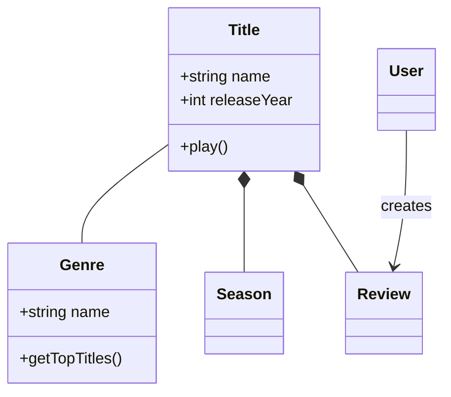
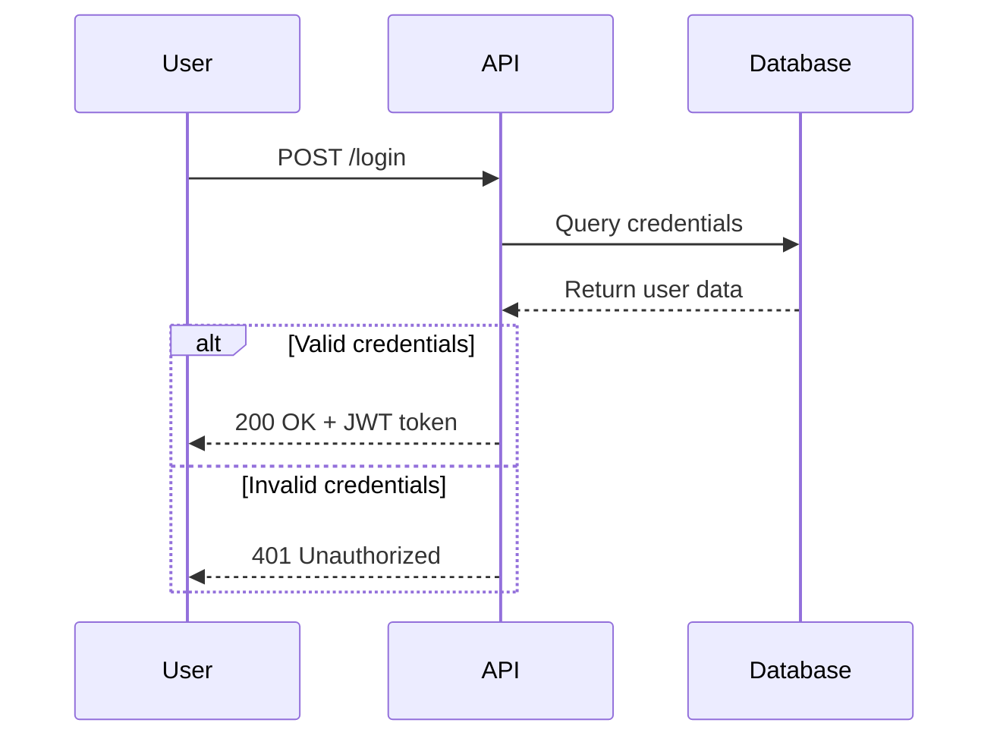
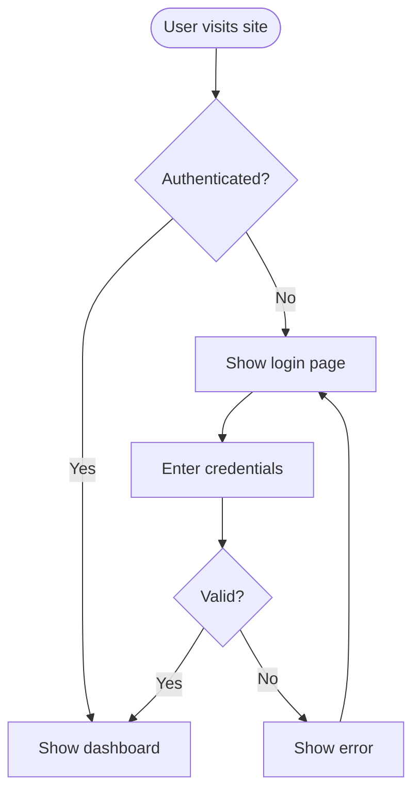
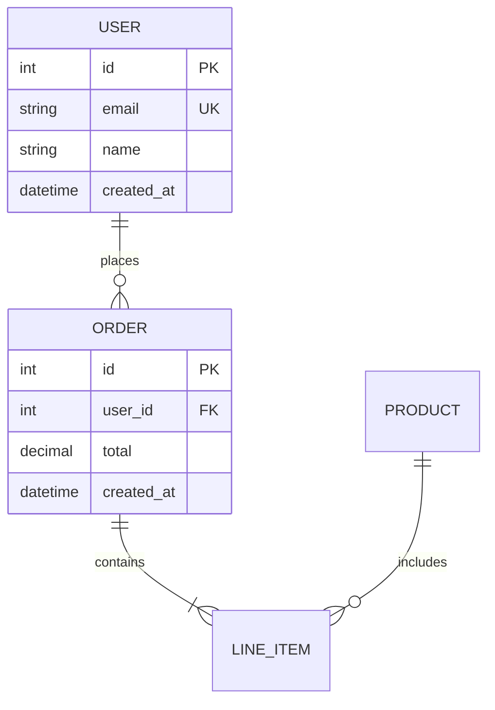
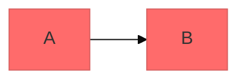

# Mermaid Diagramming

Create professional software diagrams using Mermaid's text-based syntax. Mermaid renders diagrams from simple text definitions, making them version-controllable, easy to update, and maintainable alongside code.

## Core Syntax Structure

All Mermaid diagrams follow this pattern:

```mermaid
diagramType
  definition content
```

**Key principles:**

- The first line declares the diagram type (e.g., `classDiagram`, `sequenceDiagram`, `flowchart`).
- Use `%%` for comments.
- Line breaks and indentation improve readability but aren't required.
- Unknown words break diagrams; parameters fail silently.

## Diagram Type Selection Guide

**Choose the right diagram type:**

1. **Class Diagrams** - For domain modeling, OOP design, and entity relationships.
2. **Sequence Diagrams** - For temporal interactions and message flows.
3. **Flowcharts** - For processes, algorithms, and decision trees.
4. **Entity Relationship Diagrams (ERD)** - For database schemas and data modeling.
5. **C4 Diagrams** - For software architecture at multiple levels.
6. **State Diagrams** - For state machines and lifecycle states.
7. **Git Graphs** - For version control branching strategies.
8. **Gantt Charts** - For project timelines and scheduling.
9. **Pie/Bar Charts** - For data visualization.

## Quick Start Examples

### Class Diagram (Domain Model)



### Sequence Diagram (API Flow)



### Flowchart (User Journey)



### ERD (Database Schema)



## Best Practices

1. **Start Simple** - Begin with core entities/components, adding details incrementally.
2. **Use Meaningful Names** - Clear labels make diagrams self-documenting.
3. **Comment Extensively** - Use `%%` comments to explain complex relationships.
4. **Keep Focused** - One diagram per concept; split large diagrams into multiple focused views.
5. **Version Control** - Store `.mmd` files alongside code for easy updates.
6. **Add Context** - Include titles and notes to explain diagram purpose.
7. **Iterate** - Refine diagrams as understanding evolves.

## Configuration and Theming

Configure diagrams using frontmatter:



**Available themes:** default, forest, dark, neutral, base.

## Exporting and Rendering

**Native support in:**

- GitHub/GitLab - Automatically renders in Markdown.
- VS Code - With Markdown Mermaid extension.
- Notion, Obsidian, Confluence - Built-in support.

**Export options:**

- [Mermaid Live Editor](https://mermaid.live) - Online editor with PNG/SVG export.
- Mermaid CLI - `npm install -g @mermaid-js/mermaid-cli` then `mmdc -i input.mmd -o output.png`.

## Common Pitfalls

- **Breaking characters** - Avoid `{}` in comments, use proper escape sequences for special characters.
- **Syntax errors** - Misspellings break diagrams; validate syntax in Mermaid Live.
- **Overcomplexity** - Split complex diagrams into multiple focused views.
- **Missing relationships** - Document all important connections between entities.

## When to Create Diagrams

**Always diagram when:**

- Starting new projects or features.
- Documenting complex systems.
- Explaining architecture decisions.
- Designing database schemas.
- Planning refactoring efforts.
- Onboarding new team members.

**Use diagrams to:**

- Align stakeholders on technical decisions.
- Document domain models collaboratively.
- Visualize data flows and system interactions.
- Plan before coding.
- Create living documentation that evolves with code.

## Resources

- [Mermaid Documentation](https://mermaid.js.org/intro/)
- [Live Editor](https://mermaid.live/)
- [Mermaid CLI](https://github.com/mermaid-js/mermaid-cli)
- [GitHub Mermaid Support](https://docs.github.com/en/get-started/writing-on-github/working-with-advanced-formatting/creating-diagrams)