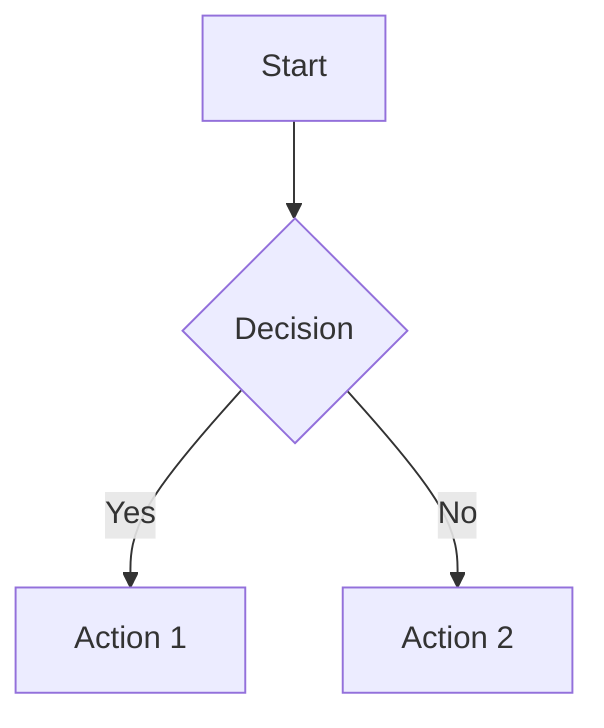
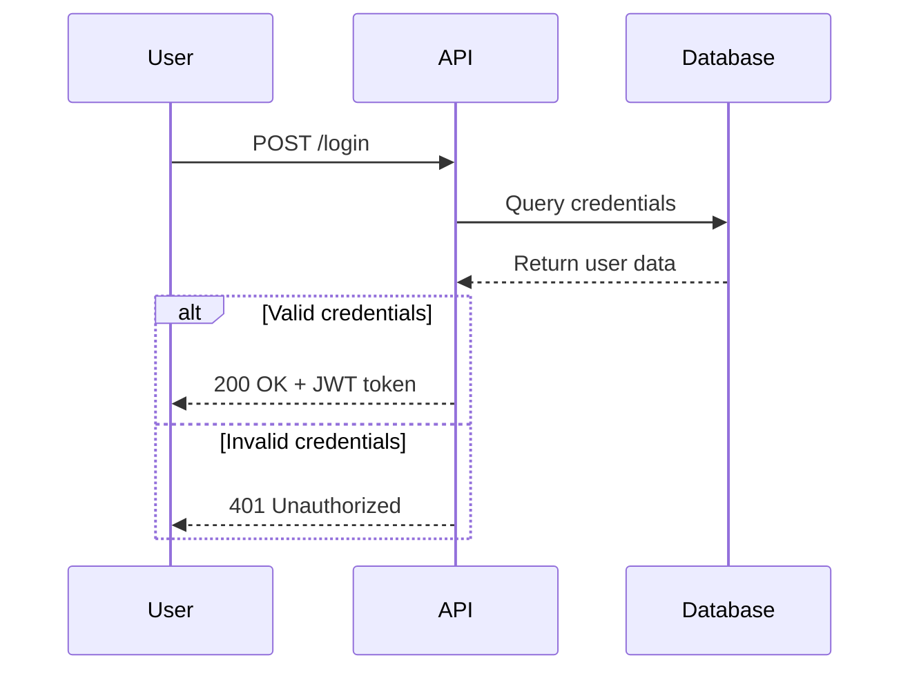
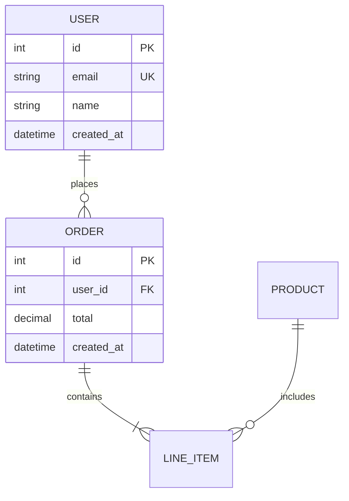

# Mermaid Diagramming Skill

This skill enables the creation, editing, and validation of diagrams using Mermaid syntax, making it ideal for visualizing system architecture, workflows, database schemas, and more.

## When to Use This Skill

- Visualizing system architecture
- Documenting data flows and workflows
- Creating database entity-relationship diagrams
- Sequence diagrams for API interactions
- State diagrams for workflows
- Flowcharts for decision logic
- Updating architecture documentation
- Validating and troubleshooting Mermaid diagrams

## Supported Diagram Types

- **Flowchart**: Processes, decision trees
- **Sequence Diagram**: API interactions, message flows
- **Class Diagram**: Object-oriented structures, domain modeling
- **ER Diagram**: Database relationships, schemas
- **State Diagram**: State machines, workflow states
- **Gantt Chart**: Project timelines
- **Git Graph**: Version control branching strategies
- **Pie Chart**: Data distributions
- **Journey**: User experience flows
- **Timeline**: Historical events

## Core Syntax Structure

All Mermaid diagrams follow this pattern:

```mermaid
diagramType
  definition content
```

### Key Principles
- Start with the diagram type declaration (e.g., `classDiagram`, `sequenceDiagram`, `flowchart`)
- Use `%%` for comments
- Maintain readability with line breaks and indentation

## Creating Diagrams

### Quick Start

1. **Identify the right diagram type** based on what you're visualizing.
2. **Choose appropriate layout** (TB=top-to-bottom, LR=left-to-right, etc.).
3. **Keep it readable** - avoid overcrowding nodes.
4. **Use consistent styling** - colors and shapes should have meaning.
5. **Add meaningful labels** - clear, concise descriptions.

### Example Diagrams

#### Flowchart Example


#### Sequence Diagram Example


#### ER Diagram Example


## Validation and Troubleshooting

### Validation Workflow

1. **Create the Diagram**: Follow the syntax rules.
2. **Validate Using CLI Tool**: Use `rp1 agent-tools mmd-validate` to check for errors.
3. **Handle Validation Results**: Review the output for any errors and fix them accordingly.

### Common Error Categories
- **ARROW_SYNTAX**: Incorrect arrow types
- **QUOTE_ERROR**: Unquoted labels with special characters
- **CARDINALITY**: Incorrect ER notation
- **LINE_BREAK**: Missing line breaks between statements
- **DIAGRAM_TYPE**: Unknown diagram type

## Best Practices

1. **Start Simple**: Begin with core entities/components, adding details incrementally.
2. **Use Meaningful Names**: Clear labels make diagrams self-documenting.
3. **Comment Extensively**: Use `%%` comments to explain complex relationships.
4. **Keep Focused**: One diagram per concept; split large diagrams into multiple focused views.
5. **Version Control**: Store `.mmd` files alongside code for easy updates.

## Resources

- **Mermaid Documentation**: [Mermaid.js](https://mermaid.js.org)
- **Live Editor**: [Mermaid Live Editor](https://mermaid.live)

## Conclusion

This skill provides a comprehensive approach to creating and managing Mermaid diagrams, ensuring clarity and accuracy in visual documentation.