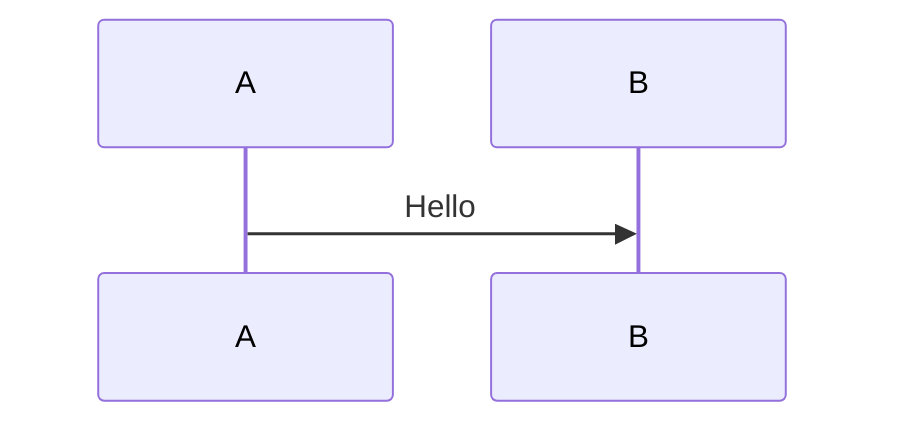

# Creating Diagrams

## Use Cases

This skill supports creating architecture documentation, workflows, data flows, comparisons, file trees, sequence diagrams, and state machines.

## Operations

### Format Selection

| Format      | Best For                                                 | Renders In         |
| ----------- | -------------------------------------------------------- | ------------------ |
| __ASCII__   | AI-maintained docs, terminals, code comments, git diffs  | Everywhere         |
| __Mermaid__ | Complex auto-layout, dependency trees, sequence diagrams | Markdown renderers |
| __Tables__  | Comparisons, feature matrices                            | Markdown           |

**Key tradeoffs:**

* ASCII: works everywhere, clear git diffs, but manual layout is tedious.
* Mermaid: auto-layout, parseable, but requires a renderer.

### Creating ASCII Diagrams

- Reference `references/ascii-patterns.md` for box diagrams, flows, file trees, decision branches, and sequence diagrams.
- Ensure all lines in a boxed diagram end at the same column to avoid ragged edges.

**Example of Right Edge Alignment:**

```plaintext
WRONG (ragged right edges):
┌───────────────────────────┐
│  Frontend                 │
│  ┌──────┐   ┌───────┐    │
│  │ React│   │ Redux │    │
│  └──────┘   └───────┘│
└───────────────────────────┘

RIGHT (all lines end at same column):
┌──────────────────────────────┐
│  Frontend                    │
│  ┌──────────┐   ┌──────────┐ │
│  │  React   │   │  Redux   │ │
│  └──────────┘   └──────────┘ │
└──────────────────────────────┘
```

### Creating Mermaid Diagrams

- Reference `references/mermaid-syntax.md` for flowcharts, sequence diagrams, state diagrams, class diagrams, and Gantt charts.
- Add one-click preview URLs above Mermaid code blocks for easy access.

**Example of Mermaid Syntax:**



### Diagram Standards

When creating or updating diagrams, apply the following standards:

1. **Every Arrow Needs a Label**: Unlabeled arrows force readers to guess the relationship.
2. **No Dead Ends**: Every process node needs input AND output arrows.
3. **Single Abstraction Level Per Diagram**: Create separate diagrams for different abstraction levels.
4. **Connect All Subgraphs**: Show relationships between subgraphs.
5. **Required Elements**: Include a legend and a descriptive title for clarity.

### Verification Checklist

Before finalizing any diagram, ensure:

- [ ] Every arrow has a label describing the flow/relationship.
- [ ] No orphaned nodes or subgraphs.
- [ ] Every process has both input and output arrows.
- [ ] Single abstraction level throughout.
- [ ] Legend explains arrow and shape meanings.
- [ ] Title clarifies the diagram's semantic intent.

## Appendix

### Sources

Synthesized from various resources, including ASCII visualizers and diagramming best practices.