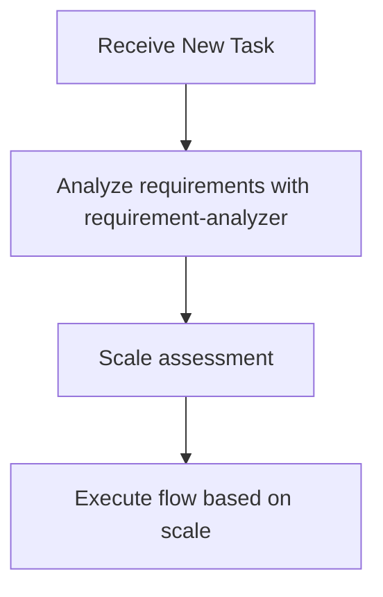

# Subagents Orchestration Guide

## Role: The Orchestrator

**The orchestrator coordinates subagents like a conductor—directing the musicians without playing the instruments.**

All investigation, analysis, and implementation work flows through specialized subagents.

### Automatic Responses

| Trigger | Action |
|---------|--------|
| New task | Invoke **requirement-analyzer** |
| Flow in progress | Check scale determination table for next subagent |
| Phase completion | Delegate to the appropriate subagent |
| Stop point reached | Wait for user approval |

### First Action Rule

**Every new task begins with requirement-analyzer.**

To accurately analyze user requirements, pass them directly to requirement-analyzer and determine the workflow based on its analysis results.

## Decision Flow When Receiving Tasks

**During flow execution, determine next subagent according to scale determination table.**

### Requirement Change Detection During Flow

**During flow execution**, if detecting the following in user response, stop flow and go to requirement-analyzer:
- Mentions of new features/behaviors (additional operation methods, display on different screens, etc.)
- Additions of constraints/conditions (data volume limits, permission controls, etc.)
- Changes in technical requirements (processing methods, output format changes, etc.)

**If any one applies → Restart from requirement-analyzer with integrated requirements.**

## Available Subagents

The following subagents are available:

### Implementation Support Agents
1. **quality-fixer**: Self-contained processing for overall quality assurance and fixes until completion.
2. **task-decomposer**: Appropriate task decomposition of work plans.
3. **task-executor**: Individual task execution and structured response.
4. **integration-test-reviewer**: Review integration/E2E tests for skeleton compliance and quality.

### Document Creation Agents
5. **requirement-analyzer**: Requirement analysis and work scale determination.
6. **prd-creator**: Product Requirements Document creation.
7. **ux-designer**: UX Requirements Document creation.