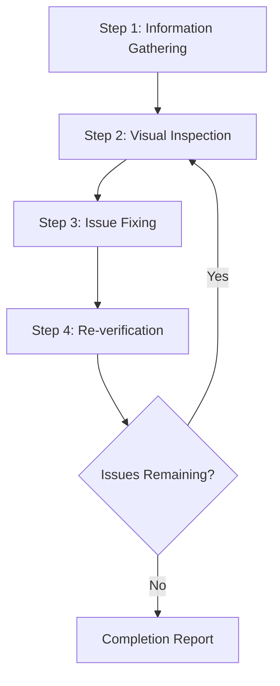

# Web Design Reviewer

This skill enables visual inspection and validation of website design quality, identifying and fixing issues at the source code level.

## Scope of Application

- Static sites (HTML/CSS/JS)
- SPA frameworks such as React / Vue / Angular / Svelte
- Full-stack frameworks such as Next.js / Nuxt / SvelteKit
- CMS platforms such as WordPress / Drupal
- Any other web application

## Prerequisites

### Required

1. **Target website must be running**
   - Local development server (e.g., `http://localhost:3000`)
   - Staging environment
   - Production environment (for read-only reviews)

2. **Browser automation must be available**
   - Screenshot capture
   - Page navigation
   - DOM information retrieval

3. **Access to source code (when making fixes)**
   - Project must exist within the workspace

## Workflow Overview



## Step 1: Information Gathering Phase

### 1.1 URL Confirmation

If the URL is not provided, ask the user:

> Please provide the URL of the website to review (e.g., `http://localhost:3000`)

### 1.2 Understanding Project Structure

When making fixes, gather the following information:

| Item            | Example Question                              |
| --------------- | --------------------------------------------- |
| Framework       | Are you using React / Vue / Next.js, etc.?    |
| Styling Method  | CSS / SCSS / Tailwind / CSS-in-JS, etc.       |
| Source Location | Where are style files and components located? |
| Review Scope    | Specific pages only or entire site?           |

### 1.3 Automatic Project Detection

Attempt automatic detection from files in the workspace:

```
Detection targets:
├── package.json     → Framework and dependencies
├── tsconfig.json    → TypeScript usage
├── tailwind.config  → Tailwind CSS
├── next.config      → Next.js
├── vite.config      → Vite
├── nuxt.config      → Nuxt
└── src/ or app/     → Source directory
```