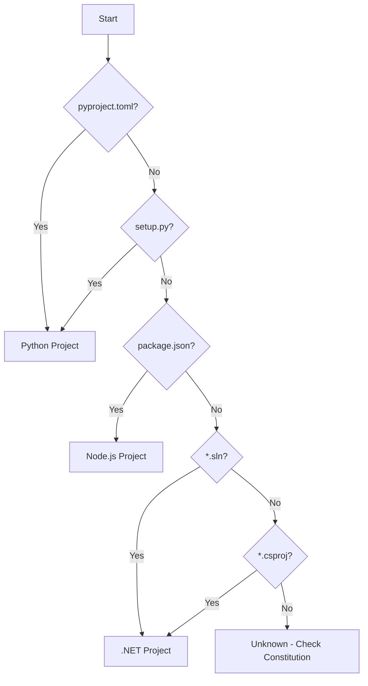

# Skill body

## Purpose

Provide a unified build command that:
1. Auto-detects project language(s) from configuration files.
2. Runs language-appropriate build stages.
3. Reports findings in a consistent format.
4. Integrates with agent-ops-baseline for comparison.

## When to Use

- Running a full build pipeline.
- Validating changes before commit.
- Capturing baseline metrics.
- When constitution lacks explicit build commands.

## Detection Logic



## Language Detection

| Language         | Indicators                                   | Priority |
|------------------|----------------------------------------------|----------|
| Python           | `pyproject.toml`, `setup.py`, `requirements.txt` | 1        |
| TypeScript/JS    | `package.json`, `tsconfig.json`             | 2        |
| C#/.NET          | `*.sln`, `*.csproj`                          | 3        |

For mixed projects, run pipelines in priority order.

## Build Pipelines

### Python Pipeline

```
Stage 1: Dependencies  → uv sync / pip install
Stage 2: Format        → ruff format --check
Stage 3: Lint          → ruff check
Stage 4: Type Check    → mypy src/
Stage 5: Test          → pytest --cov
Stage 6: Coverage      → Check threshold
```

**Commands:**
```bash
uv sync
uv run ruff format --check .
uv run ruff check .
uv run mypy src/
uv run pytest --cov=src --cov-report=term-missing
```

### TypeScript/Node.js Pipeline

```
Stage 1: Dependencies  → npm ci / pnpm install
Stage 2: Format        → prettier --check
Stage 3: Lint          → eslint
Stage 4: Type Check    → tsc --noEmit
Stage 5: Test          → vitest run / jest
Stage 6: Coverage      → Check threshold
```

**Commands:**
```bash
pnpm install
pnpm run format:check
pnpm run lint
pnpm run typecheck
pnpm run test:coverage
```

### C#/.NET Pipeline

```
Stage 1: Dependencies  → dotnet restore
Stage 2: Format        → dotnet format --verify-no-changes
Stage 3: Build         → dotnet build
Stage 4: Test          → dotnet test
Stage 5: Coverage      → Check threshold
```

**Commands:**
```bash
dotnet restore
dotnet format --verify-no-changes
dotnet build
dotnet test
```