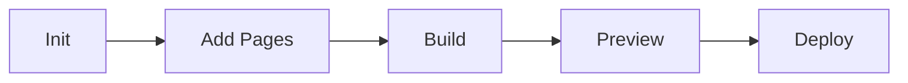

# Skill body

## Purpose

Provide comprehensive management capabilities for MkDocs documentation sites, including initialization, page management, navigation generation, local preview, and deployment.

## When to Use

- Setting up project documentation
- Adding or updating documentation pages
- Generating navigation from the directory structure
- Building and previewing the documentation site locally
- Deploying documentation updates to GitHub Pages

## Workflow Overview



## Commands

### Initialize Site

Set up a new MkDocs site with the Material theme.

**Input:**
- Project name
- Site URL (optional)
- Theme options (optional)

**Process:**
1. Create `mkdocs.yml` with Material theme configuration.
2. Create `docs/` directory structure.
3. Create `docs/index.md` home page.
4. Add recommended extensions (admonition, tabs, mermaid).

**Output:**
```
mkdocs.yml
docs/
├── index.md
├── getting-started.md
└── assets/
    └── .gitkeep
```

**Example:**
```
Initialize MkDocs documentation for this project
```

### Add Page

Add a new documentation page.

**Input:**
- Page title
- Section (optional)
- Content or template

**Process:**
1. Create a markdown file in the appropriate location.
2. Update `nav` in `mkdocs.yml`.
3. Add basic structure (title, sections).

**Example:**
```
Add a page called "API Reference" in the reference section
```

### Generate Navigation

Auto-generate the navigation structure from the `docs/` directory.

**Process:**
1. Scan `docs/` directory recursively.
2. Extract titles from markdown files.
3. Build navigation tree.
4. Update `mkdocs.yml`.

**Example:**
```
Update mkdocs navigation from directory structure
```

### Build Site

Build the static documentation site.

**Process:**
1. Run `mkdocs build`.
2. Report any warnings/errors.
3. Output to `site/` directory.

**Example:**
```
Build the documentation site
```

### Preview Site

Start a local development server.

**Process:**
1. Run `mkdocs serve`.
2. Report URL (typically http://localhost:8000).
3. Watch for changes.

**Example:**
```
Preview the documentation locally
```

### Deploy to GitHub Pages

Deploy documentation to GitHub Pages.

**Process:**
1. Run `mkdocs gh-deploy`.
2. Ensure the `gh-pages` branch is updated with the latest build.

**Example:**
```
Deploy the documentation to GitHub Pages
```