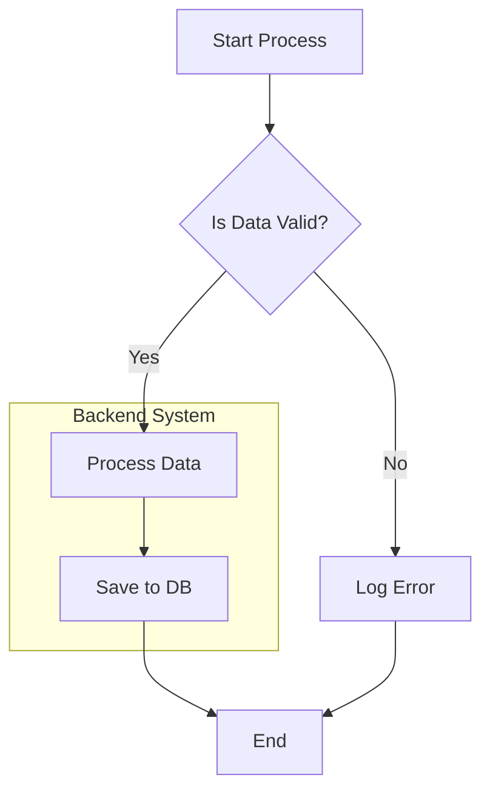

# Skill body

## Purpose

The `mermaid-diagramming` skill provides guidelines for creating error-free Mermaid diagrams, ensuring that they render correctly and adhere to best practices.

## 1. Syntax Enforcement

### Use `flowchart`
- **ALWAYS** use `flowchart TD` (Top-Down) or `flowchart LR` (Left-Right).
- **NEVER** use `graph` (deprecated) or other diagram types unless explicitly requested.

### Node Definitions
- **IDs**: Use simple alphanumeric IDs for nodes (e.g., `A`, `Node1`, `ProcessA`).
- **Labels**: **ALWAYS** wrap label text in double quotes `""`.
    - **Correct**: `A["User clicks 'Process'"]`
    - **Incorrect**: `A[User clicks 'Process']` (This will fail on quotes or parentheses)
- **Special Characters**: If a label contains `(`, `)`, `[`, `]`, `{`, `}`, `"`, or `'`, it **MUST** be double-quoted.

## 2. Structural Rules

### Decisions
- Use `{}` for decision nodes (`rhombus` shape).
    - **Correct**: `D{"Is Valid?"}`
    - **Incorrect**: `D["Is Valid?"]` (This is a rectangle, technically valid but semantically incorrect)

### Connections
- Use `-->` for standard arrows.
- Use `-.->` for dotted links.
- Use `==>` for thick structural links.
- Labels on links: Place them after the arrow.
    - `A -->|Success| B`
    - `A -- Failure --> C`

### Subgraphs
- Use `subgraph` to group related nodes.
- Ensure `end` closes the subgraph.
- Give the subgraph an ID and a Label.
    ```mermaid
    subgraph S1 ["Component A"]
        A["Start"]
    end
    ```

## 3. Common Errors to Avoid

- **Unescaped Quotes**: `A["Say "Hello""]` -> **Error**. Use single quotes inside or escape: `A["Say 'Hello'"]`.
- **Mixing Syntax**: Avoid using features from other diagram types (e.g., `alt` or `opt` from Sequence Diagrams) inside a `flowchart`.
- **Empty Nodes**: `A[]` -> **Error**.
- **Trailing Semicolons**: While allowed, they are unnecessary.

## 4. Examples

### ✅ Good Example



### ❌ Bad Example

```mermaid
graph TD                   %% Use flowchart, not graph
``` 

## When to Use This Skill

Use `mermaid-diagramming` when:
- Creating new Mermaid diagrams (flowcharts, sequence diagrams, etc.)
- Fixing parse errors or rendering issues in existing diagrams
- Validating diagram syntax before committing to documentation
- Need best practice guidance for node naming, styling, and structure conventions