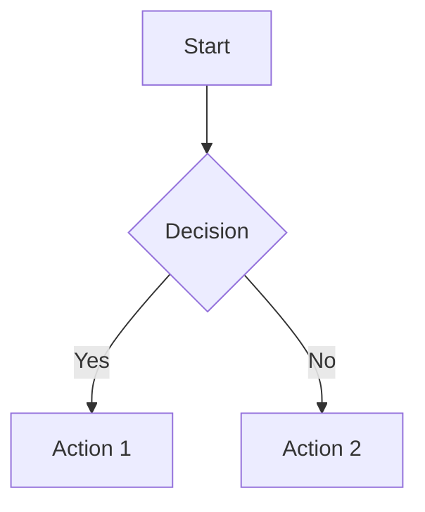

# Skill Body

## Overview

This skill helps you create and maintain diagrams using Mermaid's text-based syntax. It supports various diagram types, including flowcharts, sequence diagrams, class diagrams, entity relationship diagrams (ERDs), state diagrams, and Gantt charts.

## When to Use This Skill

- Visualizing system architecture
- Documenting data flows and workflows
- Creating database entity-relationship diagrams
- Sequence diagrams for API interactions
- State diagrams for workflows
- Flowcharts for decision logic
- Updating architecture documentation
- Validating and troubleshooting existing Mermaid diagrams

## Supported Diagram Types

- **Flowcharts**: Processes and decision trees
- **Sequence Diagrams**: API interactions and workflows
- **Class Diagrams**: Object-oriented structures and domain modeling
- **State Diagrams**: State machines and transitions
- **Entity Relationship Diagrams (ERD)**: Database schemas
- **Gantt Charts**: Project timelines
- **Git Graphs**: Version control branching strategies

## Quick Start

### Creating a New Diagram

1. **Identify the right diagram type** based on what you're visualizing.
2. **Choose appropriate layout** (TB=top-to-bottom, LR=left-to-right, etc.).
3. **Follow proper syntax conventions**:
   - Start with the diagram type declaration.
   - Use consistent indentation and meaningful labels.
   - Avoid overcrowding nodes for readability.

### Editing Existing Diagrams

1. **Preserve the structure**: Maintain existing node IDs and relationships.
2. **Match the style**: Use the same syntax patterns and formatting.
3. **Test incrementally**: Verify changes render correctly.
4. **Document changes**: Add comments for complex modifications.

### Validation Workflow

1. **Create the Diagram**: Follow the syntax rules and create your diagram.
2. **Validate Using CLI Tool**: Use the `rp1 agent-tools mmd-validate` command to check for syntax errors.
3. **Handle Validation Results**: Review the output for any errors and make necessary corrections.

## Example Diagram

## Additional Tips

- Use subgraphs to organize complex flows.
- Apply consistent styling to enhance clarity (e.g., colors for categories).
- Keep diagrams under 15-20 nodes for optimal readability.