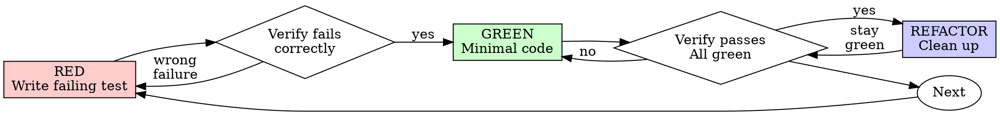

# Test-Driven Development (TDD)

## Overview

Write the test first. Watch it fail. Write minimal code to pass.

**Core principle:** If you didn't watch the test fail, you don't know if it tests the right thing.

## When to Use

**Always:**
- New features
- Bug fixes
- Refactoring
- Behavior changes

**Exceptions (ask your human partner):**
- Throwaway prototypes
- Generated code
- Configuration files

## The Iron Law

```
NO PRODUCTION CODE WITHOUT A FAILING TEST FIRST
```

If you find yourself writing implementation code before tests, STOP immediately. Delete the implementation and start over with TDD.

## Red-Green-Refactor Cycle



### Steps to Follow

1. **Write a Failing Test (RED phase)**: Create a test that demonstrates the desired behavior.
2. **Verify the Test Fails**: Ensure the test fails due to the behavior of the application, not due to the test itself.
3. **Write Minimal Code (GREEN phase)**: Implement the least amount of code necessary to make the test pass.
4. **Verify the Test Passes**: Confirm that the test now passes due to the behavior of the application.
5. **Refactor the Code**: Clean up the code while ensuring all tests still pass.

### Test Writing Guidelines

- Always test real behavior.
- Avoid writing tests that are just mocks or test implementation details.
- Focus on writing tests for integration boundaries.
- Only unit test utilities; production code must be end-to-end tested.

### Example Test

<Good>
```typescript
test('retries failed operations 3 times', async () => {
  let attempts = 0;
  const operation = () => {
    attempts++;
    if (attempts < 3) throw new Error('fail');
    return 'success';
  };

  const result = await retryOperation(operation);

  expect(result).toBe('success');
  expect(attempts).toBe(3);
});
```
</Good>

<Bad>
```typescript
test('retry works', async () => {
  const mock = jest.fn()
    .mockRejectedValueOnce(new Error())
    .mockRejectedValueOnce(new Error())
    .mockResolvedValueOnce('success');
  await retryOperation(mock);
  expect(mock)
```
</Bad>