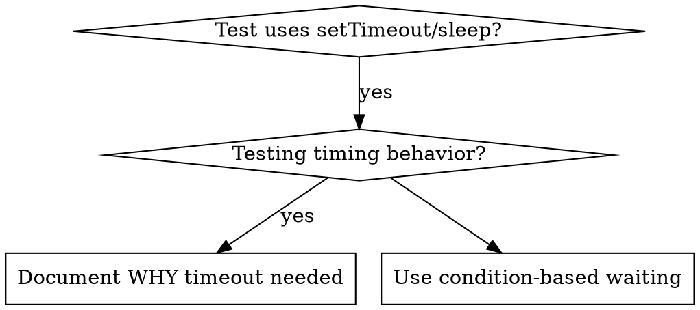

# Condition-Based Waiting

## Overview

Flaky tests often guess at timing with arbitrary delays, leading to race conditions where tests pass on fast machines but fail under load or in CI. The core principle is to wait for the actual condition you care about, rather than guessing how long it takes.

## When to Use



**Use when:**
- Tests have arbitrary delays (`setTimeout`, `sleep`, `time.sleep()`)
- Tests are flaky (pass sometimes, fail under load)
- Tests timeout when run in parallel
- Waiting for async operations to complete

**Don't use when:**
- Testing actual timing behavior (debounce, throttle intervals)
- Event-based systems are available (e.g., WebSockets, EventEmitters)
- Always document WHY if using arbitrary timeout

## Core Pattern

```typescript
// ❌ BEFORE: Guessing at timing
await new Promise(r => setTimeout(r, 50));
const result = getResult();
expect(result).toBeDefined();

// ✅ AFTER: Waiting for condition
await waitFor(() => getResult() !== undefined);
const result = getResult();
expect(result).toBeDefined();
```

## Quick Patterns

| Scenario          | Pattern                                              |
| ----------------- | ---------------------------------------------------- |
| Wait for event    | `waitFor(() => events.find(e => e.type === 'DONE'))` |
| Wait for state    | `waitFor(() => machine.state === 'ready')`           |
| Wait for count    | `waitFor(() => items.length >= 5)`                   |
| Wait for file     | `waitFor(() => fs.existsSync(path))`                 |
| Complex condition | `waitFor(() => obj.ready && obj.value > 10)`         |

## Implementation

Generic polling function:

```typescript
async function waitFor<T>(
  condition: () => T | undefined | null | false,
  description: string,
  timeoutMs = 5000
): Promise<T> {
  const startTime = Date.now();

  while (true) {
    const result = condition();
    if (result) return result;

    if (Date.now() - startTime > timeoutMs) {
      throw new Error(`Timeout waiting for: ${description}`);
    }

    await new Promise(resolve => setTimeout(resolve, 100)); // Polling interval
  }
}
```